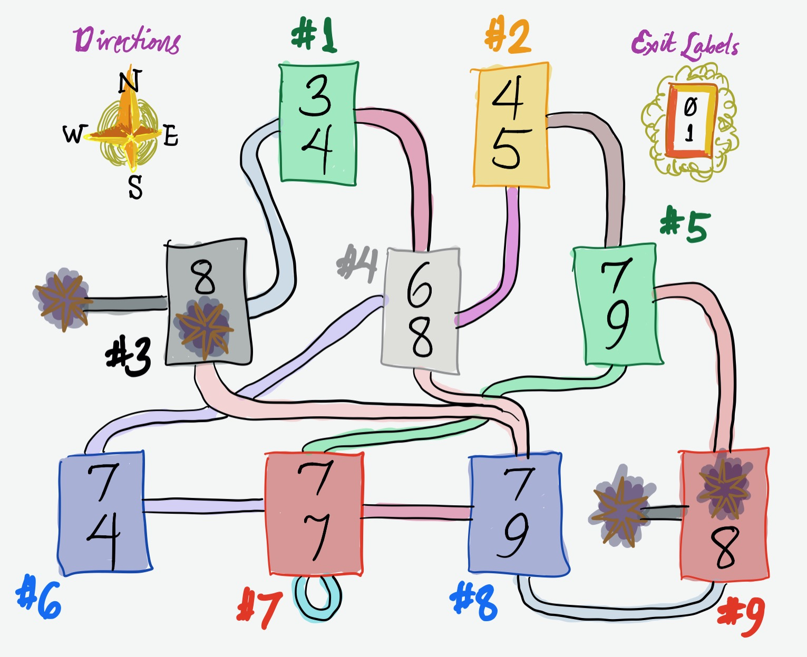

CS61 2020: Kernel 3
===================

Today’s lecture will go more in depth into the teaching kernel in the
`kernel1` lecture directory. (There is no code in the `kernel3` directory.)

Advance work
------------

*Advance work should be completed before lecture, especially by active
listeners. There is nothing to turn in.*

We are using the DemoOS kernel from the Kernel 1 lecture for today’s work, so
perform the advance work for the Kernel 1 lecture if you haven’t already.

Then do **one** of the following two sections. (The virtual memory map game
looks better [viewed on GitHub](https://github.com/cs61/cs61-lectures/blob/main/kernel3/README.md).)

Memory attack
-------------

Change `p-eve.cc` to attack the Alice process *using memory*. That is, using
only memory reads and writes, Eve should change the state of the OS so that
Alice never prints again (but ideally Eve keeps running). There are many
memory locations you could modify; try picking something creative!

Virtual memory map maze
-----------------------



This game is a kind of metaphor for virtual memory.

You’re going to be teleported into a weird dungeon where you may only move
according to the rules. You get to pick a **starting room** (a number from 1
to 9) and a **path**, which is a bitstring of a given length (for instance,
`01`). Then you’ll walk through the maze starting from your room by taking the
exits indicated by your bits in sequence:

```
+-----+
|  X  |  <- exit to take for bit 0
|  Y  |  <- exit to take for bit 1
+-----+
```

For instance, if you start in room \#1 with bitstring `00`, you will end up in
room \#8. (The `0` exit from \#1 leads to \#3. The `0` exit from \#3 leads to
\#8.) There are death pits hanging off \#3 and \#9.

1. Give a starting room from which you can reach *all* blue and red rooms
   (\#6–9) in exactly two steps.

2. Give a starting room from which you can reach *only* blue rooms (\#6
   and \#8) and death pits in exactly two steps.

3. Give the most boring starting room, which is the room from which you can
   reach the *minimum* number of other rooms in exactly two steps.

(Weak analogies: A room is like a memory page. The number of steps is like
page table depth. A bit is like a page table index. The starting room is like
the top-level page table address, or `%cr3`. The exit labels written in each
room are like page table entries or memory contents. A death pit is like a
page fault.)
